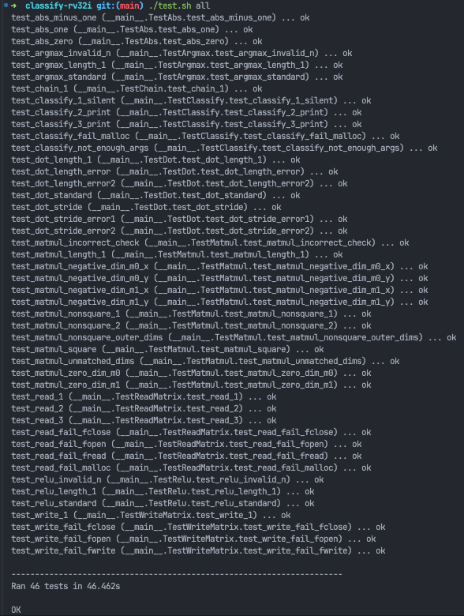

# Assignment 2: Classify

## Part 1

### my_mul.s

#### Approach

I implemented a custom multiplication function named my_mul, located in the my_mul.s file. The my_mul function uses a straightforward bitwise multiplication approach. It works by iterating over the bits of the multiplicand (stored in register a1) from low-bit to high-bit. For each iteration, it checks if the least significant bit of a1 (after right-shifting by 1 positions) is set to 1. If this bit is 1, the multiplier (stored in register a2) is left-shifted by 1 positions and added to the result register (stored in register a0).

The function take three arguments as inputs, a0, a1, and a2. a0 is for holding the initial result values. a1 and a2 are values for multiplication.

For example:

```sudo=
a1 := multiplicand
a2 := multiplier

while (a1 != 0):
  if (a1 >> 1) & 1:
    result += a2 << 1
```

```asm=
my_mul:
    blt a1, a2, loop # if a1 < a2, jump to loop
    mv t0, a2 # t0 = a2
    mv a2, a1 # a2 = a1
    mv a1, t0 # a1 = t2
loop:
    beqz a1, exit # if a2 == 0, jump to exit
    andi t0, a1, 0x1 # t0 = t0 & 0x1; bitwise AND of t2 and 0x1
    beqz t0, last_step # if t0 == 0, jump to last_step
    add a0, a0, a2
last_step:
    srli a1, a1, 1 # a1 = a1 >> 1; right shift 1 by 1
    slli a2, a2, 1 # a2 = a2 << 1; left shift a2 by 1
    j loop
exit:
    jr ra
```

This approach effectively performs multiplication by summing shifted versions of the multiplier, based on the positions of the set bits in the multiplicand.

#### Issue

While implementing my_mul, I encountered issues with register passing. Specifically, in other files, I only saved reused registers to stack memory. However, due to the caller-callee convention, I needed to actively preserve registers a0 to a7 and t0 to t6. This caused a bug that took some time to resolve, but I eventually found a solution.

### relu.s

```asm=
loop_start:
    # TODO: Add your own implementation
    lw t2, 0(a0)
    bge t2, zero, skip # if array >= 0, go to skip
    li t2, 0
    sw t2, 0(a0)
skip:
    addi a0, a0, 4
    addi t1, t1, 1
    blt t1, a1, loop_start
```

### argmax.s

#### Approach

I use a register to store the current maximum value and iterate through the array to find the highest value.

```asm=
loop_start:
    # TODO: Add your own implementation
    addi t1, t1, 1 # i++
    bge t1, a1, done # check if i < the array length
    addi a0, a0, 4 # move array pointer forward
    lw t3, 0(a0) # load the next number into t3
    bge t3, t0, greater
    j loop_start

greater:
    mv t2, t1 # assign greatest index to t2
    mv t0, t3 # assign greatest value to t0
    j loop_start
```

### dot.s

I use two loop to iterate the strides and call my_mul for multiplication.

```asm=
arr0_stride:
    mv t4, a3 # counter for arr0
# loop for arr0 stride
arr0_loop:
    addi a0, a0, 4
    addi t4, t4, -1
    bge t4, t5, arr0_loop

# loop for arr1 stride
arr1_stride:
    mv t4, a4 # counter for arr1
arr1_loop:
    addi a1, a1, 4
    addi t4, t4, -1
    bge t4, t5, arr1_loop
```

### matmul.s

#### Approach

The matmul.s requires us to complete the inner_loop_end section. In inner_loop_end, we need to advance the matrix pointers in row-major order. For matrix A, this involves adding 4 to the pointer each time we move to the next column.

```asm=
inner_loop_end:
    # TODO: Add your own implementation
    addi s0, s0, 1      # Increment outer loop counter (row index in B)
    li t0, 0
offset_loop: # Compute offset to next row in A: t1 = columns of A * 4 bytes
    beq t0, a2, outer_loop_start # If we have reached the end of the row, go to the next row
    addi t0, t0, 1 # Increment inner loop counter (column index in A)
    addi s3, s3, 4 # Move s3 to the start of the next row in A
    j offset_loop
```

### abs.s

#### Approach

I use a branch to decide whether the code runs the instruction below.

```asm=
sub t0, zero, t0
```

## Part2

### read_matrix.s, write_matrix.s, and Clasfication

#### Approach

I implement my_mul to complete the FIXME.


